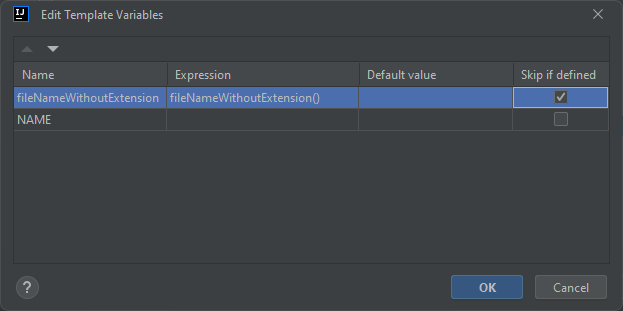

## Templates for bloc package (with freezed)

### blocWithFreezed
Creates bloc with states and events. Required additional setting:

<details>
  <summary>Open image</summary>



</details>

```dart
import 'package:flutter_bloc/flutter_bloc.dart';
import 'package:freezed_annotation/freezed_annotation.dart';

part '$fileNameWithoutExtension$.freezed.dart';

@freezed
class $NAME$State with _$$$NAME$State {
  const $NAME$State._();

  const factory $NAME$State.initial() = _Initial$NAME$State;

  const factory $NAME$State.failure({
    @Default('An error has occurred') String message,
  }) = _Failure$NAME$State;

  const factory $NAME$State.successful() = _Successful$NAME$State;
}

@freezed
class $NAME$Event with _$$$NAME$Event {
  const $NAME$Event._();

  const factory $NAME$Event.initial() = _Initial$NAME$Event;
  const factory $NAME$Event.enteredText() = _EnteredText$NAME$Event;
}

class $NAME$Bloc extends Bloc<$NAME$Event, $NAME$State> {
  $NAME$Bloc() : super(const $NAME$State.initial()) {
    on<$NAME$Event>(
      (event, emit) => event.map<Future<void>>(
        initial: (event) => _initial(event, emit),
        enteredText: (event) => _enteredText(event, emit),
      ),
    );
  }

  Future<void> _initial(
    _Initial$NAME$Event event,
    Emitter<$NAME$State> emitter,
  ) async {
    // ...
  }

  Future<void> _enteredText(
    _EnteredText$NAME$Event event,
    Emitter<$NAME$State> emitter,
  ) async {
    // ...
  }
}
```

## blocEventOrState
Adds new event or state depend on class. Required additional setting:

<details>
  <summary>Open image</summary>


</details>


```dart
const factory $dartClassName$.$eventOrStateName$() = _$capitalizeMethodName$$dartClassName$;
```

### freezedState
Creates state for BLoC with freezed. Required additional setting:

<details>
  <summary>Open image</summary>


</details>


```dart
import 'package:freezed_annotation/freezed_annotation.dart';

part '$fileNameWithoutExtension$.freezed.dart';

@freezed
class $NAME$State with _$$$NAME$State {
  const $NAME$State._();
  const factory $NAME$State.initial() = InitialState;
  
}
```