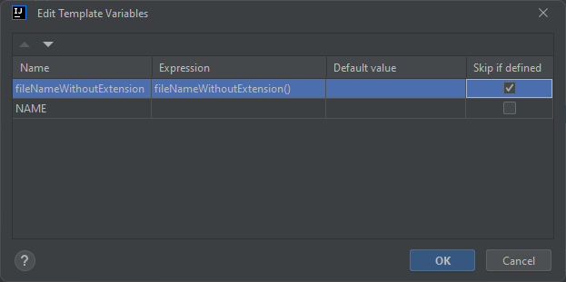
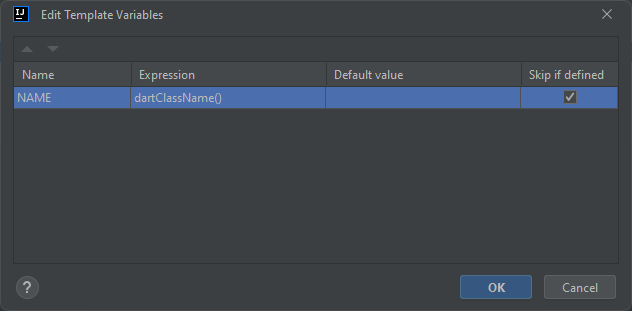

## Templates for [freezed](https://pub.dev/packages/freezed) package


### freezed
Creates base class with freezed. Required additional setting:

<details>
  <summary>Open image</summary>


</details>

```dart
import 'package:freezed_annotation/freezed_annotation.dart';

part '$fileNameWithoutExtension$.freezed.dart';

@freezed
class $NAME$ with _$$$NAME$ {
  const factory $NAME$({
      required int id,
      $END$
  }) = _$NAME$;
}
```

### freezedJson
Adds fromJson method (you should add part with .g file). Required additional setting:

<details>
  <summary>Open image</summary>



</details>

```dart
factory $NAME$.fromJson(Map<String, dynamic> json) => _$$$NAME$FromJson(json);
```

### freezedJson part addition
Adds part for json_serializable
```dart
part '$FILENAME$.g.dart';
```
